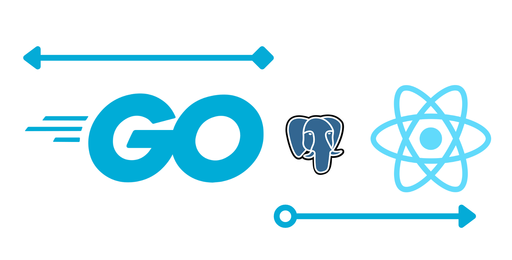

# GO-React starter


This is a basic example of a go web server with a react frontend.

It uses the [go fiber](https://github.com/gofiber/fiber) framework 

## Getting started

### Running locally
Clone this repository
Download and install [golang](https://golang.org)

Download and install [postgres](https://www.postgresql.org/download/)

Setup your postgres database, env secrets can be changed in the [.env](./server/.env) file

- [A complete guide to PostgreSQL](https://prabhupant.medium.com/a-complete-guide-to-postgresql-e4d1cefb9866)

- [Installing PostgreSQL for Mac, Linux, and Windows](https://medium.com/@dan.chiniara/installing-postgresql-for-windows-7ec8145698e3)

Ensure you have `make` installed.

```bash
make run
```

This will start the go server & the react frontend.

### Using docker
Ensure you have `docker` installed

```bash
make docker-build
make docker-run
```
Server is live on `:8081` and UI is on `:3000`

## Endpoints
| endpoint      | method | body                                           | description       |
|---------------|--------|------------------------------------------------|-------------------|
| /api/session  | GET    |                                                | GET user session  |
| /api/login    | POST   | { email String, password String }              | login user      |
| /api/register | POST   | { email String, password String, name String } | register new user |
|               |        |                                                |                   |


## Contributing
Pull requests are welcome. For major changes, please open an issue first to discuss what you would like to change.

## License
[MIT](https://choosealicense.com/licenses/mit/)
